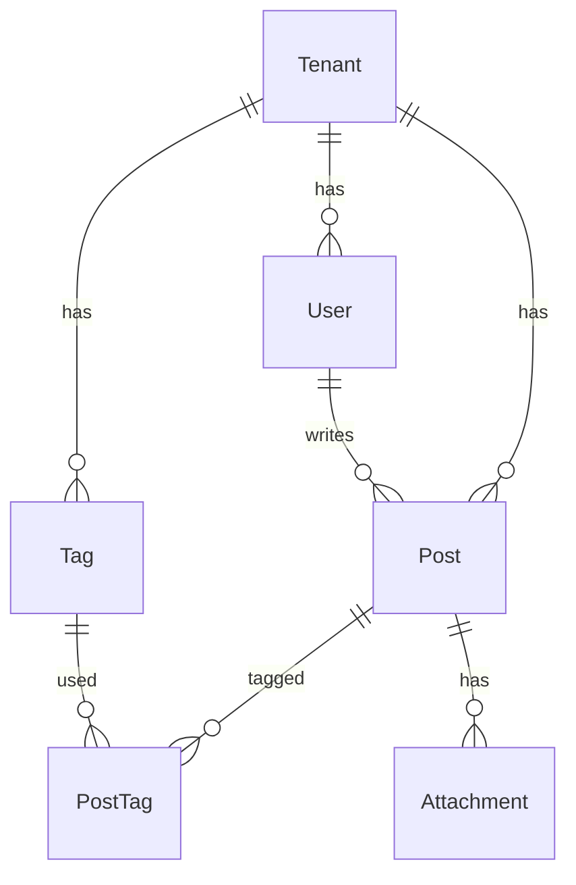

# データモデル（MVP）

## ER 概要

## テーブル

### `Tenant`

| 列        | 説明                          |
| --------- | ----------------------------- |
| id        | UUID                          |
| name      | 学校名                        |
| slug      | URL 用一意（例 `demo`）       |

### `User`（Auth.js / Google 連携）

| 列         | 説明                                      |
| ---------- | ----------------------------------------- |
| id         | cuid                                      |
| email      | **全体一意**（PrismaAdapter 要件）        |
| tenantId   | 所属テナント                              |
| tenantSlug | `Tenant.slug` のコピー（JWT 用・必須）    |

### `Post`（授業実践）

必須: `grade`, `subject`, `unit`, `aim`  
任意: `title`, `reflection`, `point`, `flow`  
`searchText`: 検索用にアプリが結合更新するテキスト（`pg_trgm` GIN インデックス）。

### `Tag` / `PostTag`

ハッシュタグは `Tag.name`（`#` なし・小文字）として `@@unique([tenantId, name])`。

### `Attachment`

`kind`: `pdf` | `slide` | `image` | `video`  
S3 互換ストレージの `storageKey` で参照。

## 全文・キーワード検索

- `searchText` にタイトル・学年・教科・単元・めあて・振り返り・POINT・流れ・タグ名を連結して保存。
- PostgreSQL `pg_trgm` + GIN で類似検索補助。
- アプリ側の一覧検索は Prisma の `contains`（`mode: insensitive`）を併用。

## マルチテナント隔離

- アプリ: `session.user.tenantId` / `tenantSlug` と URL の `tenantSlug` を照合。
- DB: `Post` / `Tag` / `PostTag` / `Attachment` に **RLS**（`set_config('jugyoBase.tenant_id', ...)` がセットされたトランザクション内でのみアクセス。`withTenantRls` を利用）。

## 権限（ロールなし）

- **編集・削除は投稿の作成者（`authorId`）のみ**。
